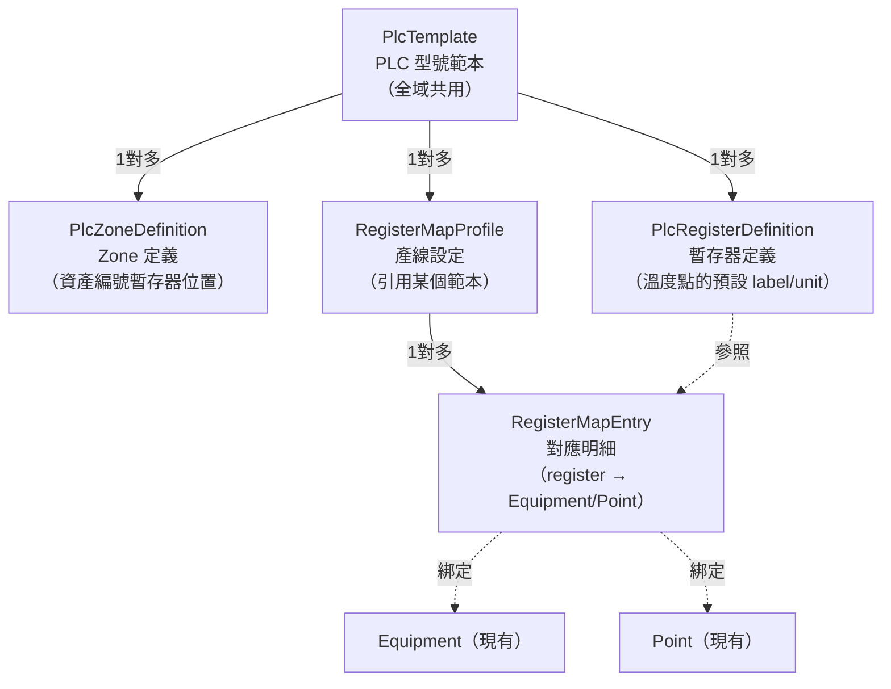

# PLC 型號範本 + 產線積木組合系統

## 問題重述

現有設計的兩個缺陷：
- Zone 數量硬編碼為 4，不同 PLC 可能有 2、6、8 個 Zone
- 沒有 PLC 型號概念，不同機型無法共用定義

## 新架構：三層結構



## DataSet 概念說明

- **DataSet（積木庫）** = `PlcTemplate` + 其下的 `PlcZoneDefinition[]` + `PlcRegisterDefinition[]`
- **組合（積木拼裝）** = 產線設定時，從 DataSet 挑選每個暫存器定義，綁定到該線的 Equipment/Point
- **同一款 PLC 的多條產線** 引用同一個 Template，只需各自設定 Equipment/Point 綁定

## Backend 新增資料模型

新增至 [`backend/Models/Entities.cs`](backend/Models/Entities.cs)：

```csharp
// PLC 型號範本（全域共用）
public class PlcTemplate
{
    [Key] public int Id { get; set; }
    [Required, MaxLength(100)] public string ModelName { get; set; } = "";
    [MaxLength(300)] public string? Description { get; set; }
    public DateTime CreatedAt { get; set; }
    public List<PlcZoneDefinition> Zones { get; set; } = [];
    public List<PlcRegisterDefinition> Registers { get; set; } = [];
}

// Zone 定義：這款 PLC 的第 N 個 Zone，資產編號藏在哪段暫存器
public class PlcZoneDefinition
{
    [Key] public int Id { get; set; }
    public int TemplateId { get; set; }
    public PlcTemplate Template { get; set; } = null!;
    public int ZoneIndex { get; set; }
    [MaxLength(50)] public string ZoneName { get; set; } = "";
    public int AssetCodeRegStart { get; set; }   // 起始地址（十進位）
    public int AssetCodeRegCount { get; set; }   // 幾個暫存器存資產編號
}

// 暫存器定義：這款 PLC 的某個暫存器地址，預設是什麼用途
public class PlcRegisterDefinition
{
    [Key] public int Id { get; set; }
    public int TemplateId { get; set; }
    public PlcTemplate Template { get; set; } = null!;
    public int RegisterAddress { get; set; }     // 十進位地址
    [MaxLength(100)] public string DefaultLabel { get; set; } = "";
    [MaxLength(10)] public string DefaultUnit { get; set; } = "℃";
    // 預設屬於哪個 Zone（可不填，讓使用者在設定時指定）
    public int? DefaultZoneIndex { get; set; }
}
```

修改現有 [`backend/Models/Entities.cs`](backend/Models/Entities.cs) 中的 `RegisterMapProfile`：

```csharp
public class RegisterMapProfile
{
    // ... 現有欄位 ...
    public int? PlcTemplateId { get; set; }       // 新增：引用哪個 PLC 範本
    public PlcTemplate? PlcTemplate { get; set; }
}
```

## Backend API 新增

新增 [`backend/Controllers/PlcTemplateController.cs`](backend/Controllers/PlcTemplateController.cs)：

- `GET /api/plc-templates` — 列出所有範本
- `GET /api/plc-templates/{id}` — 取得單一範本（含 Zones + Registers）
- `POST /api/plc-templates` — 建立新範本
- `PUT /api/plc-templates/{id}` — 更新範本
- `DELETE /api/plc-templates/{id}` — 刪除範本

## Frontend 兩個新/改 UI

### 1. 新增：PlcTemplateModal（PLC 型號管理）

獨立 Modal，從 Toolbar 或 RegisterMapModal 內進入：

```
┌── PLC 型號管理 ────────────────────────────────────┐
│  [+ 新增型號]                                       │
│  ┌────────────────────────────────────────────┐    │
│  │ 烤箱控制器 v2        [編輯] [刪除]          │    │
│  │  Zones: 4   Registers: 12                  │    │
│  └────────────────────────────────────────────┘    │
│                                                    │
│  ── 編輯: 烤箱控制器 v2 ─────────────────────────  │
│  Zone 定義（可新增刪除）:                           │
│  Zone 1  資產碼起始: 0x0010  長度: 10  [刪除]       │
│  Zone 2  資產碼起始: 0x001A  長度: 10  [刪除]       │
│  [+ 新增 Zone]                                     │
│                                                    │
│  暫存器定義（積木庫）:                              │
│  地址    預設名稱        單位  預設 Zone  [刪除]     │
│  0x0001  熱定型右溫度    ℃    Zone 1              │
│  0x0002  冷定型右溫度    ℃    Zone 1              │
│  [+ 新增暫存器]                                    │
└────────────────────────────────────────────────────┘
```

### 2. 改寫：RegisterMapModal（產線積木組合）

改為兩步驟流程：

**步驟一：選擇 PLC 型號**（尚未選時顯示）

```
┌── 暫存器對應設定 — 烤箱生產線 A ──────────────────┐
│                                                    │
│   尚未選擇 PLC 型號                                │
│                                                    │
│   [烤箱控制器 v2  ▼]     [前往管理 PLC 型號]       │
│                                                    │
│                                 [選定此型號]        │
└────────────────────────────────────────────────────┘
```

**步驟二：積木組合**（選定範本後）

```
┌── 暫存器對應設定 — 烤箱生產線 A [烤箱控制器 v2] ──┐
│  [Zone 1 (0x10)]  [Zone 2 (0x1A)]  [Zone 3...]     │
│  ── Zone 1：資產編號 0010H–0019H ─────────────────  │
│  Reg     預設名稱        對應設備        對應點位   │
│  0x0001  熱定型右溫度    [熱定型機 ▼]  [熱定型右▼] │
│  0x0002  冷定型右溫度    [冷定型機 ▼]  [冷定型右▼] │
│  （暫存器清單來自範本，不可增刪，只能選設備/點位）  │
└────────────────────────────────────────────────────┘
```

Zone 分頁數量、每個 Zone 的暫存器清單，全部來自 `PlcTemplate`，不再硬編碼。

## 實作順序

1. Backend：新增 3 個 model + 更新 `RegisterMapProfile`，DB migration
2. Backend：新增 `PlcTemplateController`
3. Frontend：新增 `PlcTemplateModal.tsx`（型號管理）
4. Frontend：改寫 `RegisterMapModal.tsx`（選型號 + 積木組合）
5. Frontend：Toolbar 新增 PLC 型號管理入口

## 現有資料遷移

現有的 `RegisterMapEntries` 不需要轉換，繼續保留，`PlcTemplateId` 設為 nullable，舊設定不受影響。
